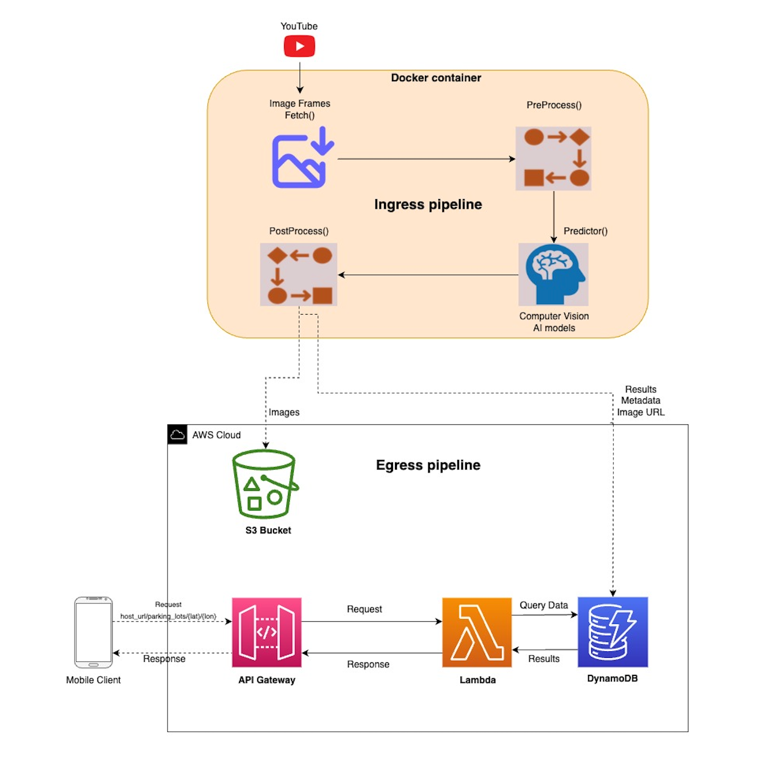

# Smart-Park-Reboot

This work is based on [Sriranga Chaitanya Nandam's Master's Project](https://research.engr.oregonstate.edu/si-lab/#archive): [Smart-Park](https://research.engr.oregonstate.edu/si-lab/archive/2022_chaitanya.pdf).
Chaitanya's original repository from which this was adapted is at [https://github.com/NSR9/Smart-Park/tree/main/smart_park](https://github.com/NSR9/Smart-Park/tree/main/smart_park)

## Getting Started

The ingress pipeline, developed by Chaitanya initially, has been modified to run as a Docker container after packaging.
The egress pipeline has also undergone modifications to retrieve data from DynamoDb in place of MongoDb. Below is a reworked architecture diagram.




## Usage

Ensure that Docker is installed on your system, and if it is not, download and install the most recent version from the following link: [Install Docker](https://docs.docker.com/get-docker/)
Then, navigate to the `/smart_park` directory where the Dockerfile is located, and execute the command:

```sh
docker build -t <image_name> .
```

Build a Docker image with the name "image_name" using the following command. Once the image is created, verify its availability by executing the `docker images` command.
After creating the image, you can run the model by starting a Docker container using the command:

```sh
docker run -d <image_name>
```

The argument "-d" is utilized for running the container in detached mode (In background).

### Contributors
#### Subramanya Keshavamurthy
